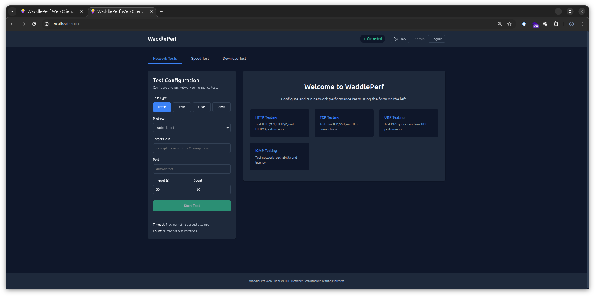
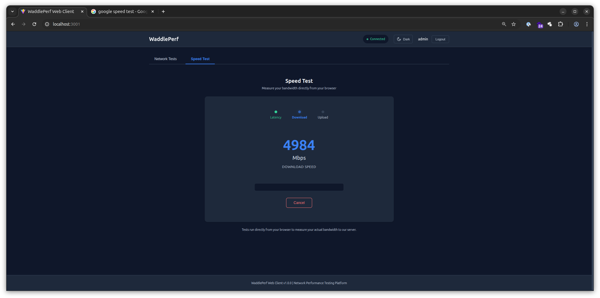
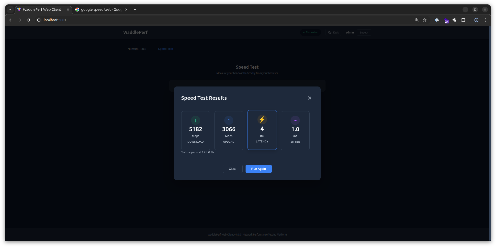
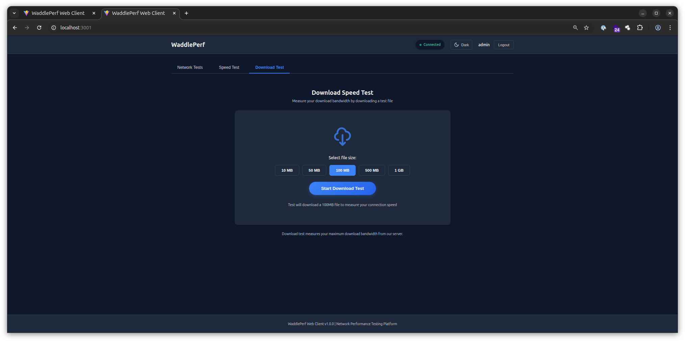
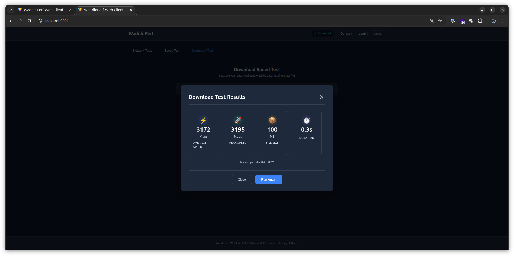

```
     ___     
    (.  \    
     \   |   ___   ___   _| | _| | | |  ___   ___    ___   _ _   ___ 
      >  )  |Wad| |ddl| |dl| |dl| | | ||Per| |rfo|  |rma| |nce| |   |
     /  /    \_/   \_/   \_/  \_/  |_/  \_/   \_/    \_/  \_\_\ |___|
    /  /     Waddle fast, test faster! 🚀
   (  (      Network Performance Testing at Penguin Speed
    \ \_     
     \__)    
```

<div align="center">
  
</div>

# WaddlePerf

This is a project to allow for complete testing of user experience from one system to another.

This can be an endpoint testing it's internet connectivity, testing latency between regions, or even within cluster.

## Features

- **Speed Testing**: Browser-based bandwidth testing (download, upload, latency, jitter)
- **Network Diagnostics**: Comprehensive HTTP/TCP/UDP/ICMP testing
- **Real-Time Monitoring**: WebSocket-based live test progress
- **Multi-Client Support**: Web, Desktop (Go), Container clients
- **Centralized Management**: User authentication, API keys, organization units
- **Historical Analytics**: Database-backed results storage and analysis

## Screenshots

<div align="center">

### Network Testing Interface
<a href="docs/screenshots/webclient-networktest-options.png" target="_blank">
  
</a>

*Configure and run HTTP, TCP, UDP, and ICMP tests with real-time results*

---

### Speed Test - Running
<a href="docs/screenshots/webclient-speedtest-running.png" target="_blank">
  
</a>

*Real-time bandwidth testing with live speed measurements*

---

### Speed Test - Results
<a href="docs/screenshots/webclient-speedtest-results.png" target="_blank">
  
</a>

*Comprehensive results showing download, upload, latency, and jitter*

---

### Download Test - Options
<a href="docs/screenshots/webclient-downloadtest-options.png" target="_blank">
  
</a>

*Select file size for sustained download performance testing*

---

### Download Test - Results
<a href="docs/screenshots/webclient-downloadtest-results.png" target="_blank">
  
</a>

*Detailed download metrics including average and peak speeds*

</div>

## AUTOPERF
All tests are given a tier number of 1-3

Our auto-perf mode runs any enabled tier 1 tests every X minutes defined by the deployer. 

It will then check to see if any upper bounds has been passed. If it has went over the upper bounds, tier 2 is ran.

If the tier 2 upper bounds are passed, it runs any defined tier 3 apps which are enabled.


Note, in autoperf mode, the tier has to be set and the tool must have been enabled.

## Results

Results are dropped to one or more of the following:
* Web Client Console
* S3 - if configured
* Syslog endpoints (coming in later versions)
* Central Management DB - if enterprise build and licensed

# Tests being ran
* Pping - https://github.com/wzv5/pping
* Httptrace - https://github.com/watson/http-traceroute
* HttpPing - https://github.com/folkertvanheusden/HTTPing
* Mtr - https://github.com/traviscross/mtr/
* SSHPing - https://github.com/spook/sshping
* MTU-Test - Our custom MTU tester which tests with DF to see what size of packet can be sent via ping
* UDP-PING - Our custom UDP ping client and server combination

# License
can be found in docs/LICENSE.md

# Contributing
can be found in docs/CONTRIBUTING.md

# Usage
* can be found in docs/USAGE.md
* please use named stable deployments, not main or latest, for production deployments without being given instructions from Penguin Technologies Inc.

All packages are scanned by socket.dev, snyk, and more to ensure security gold standard! 
However, if you find something we miss (we're only human), please open an issue or email us at: security@penguintech.io 

# Contributors
* PenguinzTech
