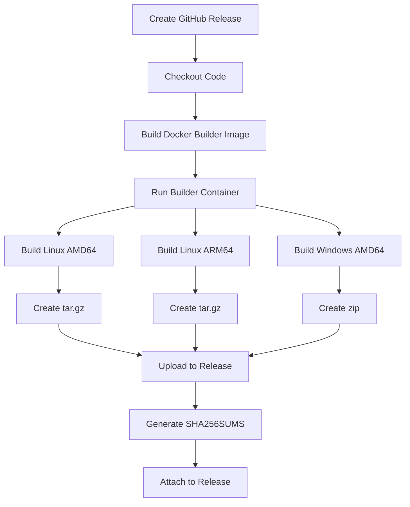

# Releasing goClient

This document describes how to create releases for the goClient with automated binary builds and GitHub Release attachments.

## Release Process

### Automated Release (Recommended)

When you create a GitHub Release, the CI/CD pipeline automatically:

1. ✅ Builds binaries for all supported platforms
2. ✅ Creates distribution packages (tar.gz, zip)
3. ✅ Generates SHA256 checksums
4. ✅ Attaches all files to the GitHub Release
5. ✅ Generates release notes

### Creating a Release

#### Option 1: GitHub Web UI

1. Go to https://github.com/penguincloud/WaddlePerf/releases
2. Click **"Draft a new release"**
3. Click **"Choose a tag"** and create a new tag (e.g., `v4.0.0`)
4. Set the **Release title** (e.g., `WaddlePerf 4.0.0`)
5. Add release notes describing changes
6. Click **"Publish release"**

The GitHub Action will automatically:
- Build all binaries
- Attach them to the release
- Add installation instructions

#### Option 2: GitHub CLI

```bash
# Create and publish a release
gh release create v4.0.0 \
  --title "WaddlePerf 4.0.0" \
  --notes "Release notes here" \
  --draft

# The workflow will build and attach binaries automatically
```

#### Option 3: Manual Workflow Dispatch

If you want to build binaries without creating a release:

1. Go to **Actions** → **Build and Release goClient**
2. Click **"Run workflow"**
3. Enter the version number
4. Click **"Run workflow"**

Binaries will be available as workflow artifacts for 90 days.

## What Gets Released

### Binary Artifacts

| Filename | Platform | Size | GUI Support |
|----------|----------|------|-------------|
| `waddleperf-linux-amd64.tar.gz` | Linux x64 | ~9 MB | ✅ Yes (systray) |
| `waddleperf-linux-arm64.tar.gz` | Linux ARM64 | ~8 MB | ❌ No |
| `waddleperf-windows-amd64.zip` | Windows x64 | ~9 MB | ✅ Yes (systray) |
| `SHA256SUMS` | Checksums | ~300 B | N/A |

### Archive Contents

Each archive contains:
- Single compiled binary
- Statically linked (no dependencies required)
- Embedded version information

Example:
```bash
$ tar tzf waddleperf-linux-amd64.tar.gz
waddleperf-linux-amd64

$ unzip -l waddleperf-windows-amd64.zip
  Length      Date    Time    Name
---------  ---------- -----   ----
  9748480  11-18-2025 03:57   waddleperf-windows-amd64.exe
```

## Versioning

WaddlePerf uses **Semantic Versioning** (SemVer):

```
MAJOR.MINOR.PATCH

Example: 4.0.0
         │ │ │
         │ │ └─ Patch: Bug fixes
         │ └─── Minor: New features (backwards compatible)
         └───── Major: Breaking changes
```

### Version Format

- **Release**: `v4.0.0` (recommended)
- **Pre-release**: `v4.0.0-beta.1`, `v4.0.0-rc.2`
- **Development**: `dev-abc1234` (git commit hash)

### Git Tags

Tags should follow this format:
```bash
# Release
git tag -a v4.0.0 -m "WaddlePerf 4.0.0"

# Pre-release
git tag -a v4.0.0-beta.1 -m "WaddlePerf 4.0.0 Beta 1"

# Push tag
git push origin v4.0.0
```

## Release Checklist

Before creating a release:

- [ ] Update version in code if applicable
- [ ] Update CHANGELOG.md or RELEASE_NOTES.md
- [ ] Test builds locally: `cd goClient && ./docker-build.sh 4.0.0`
- [ ] Verify all tests pass
- [ ] Update documentation if needed
- [ ] Create git tag
- [ ] Create GitHub Release
- [ ] Wait for CI/CD to complete (~5-10 minutes)
- [ ] Verify binaries are attached to release
- [ ] Download and test each binary
- [ ] Announce release (if major/minor)

## Downloading Release Binaries

### From GitHub Releases

```bash
# Set version
VERSION=4.0.0

# Linux AMD64
curl -LO https://github.com/penguincloud/WaddlePerf/releases/download/v${VERSION}/waddleperf-linux-amd64.tar.gz

# Linux ARM64
curl -LO https://github.com/penguincloud/WaddlePerf/releases/download/v${VERSION}/waddleperf-linux-arm64.tar.gz

# Windows AMD64
curl -LO https://github.com/penguincloud/WaddlePerf/releases/download/v${VERSION}/waddleperf-windows-amd64.zip

# Checksums
curl -LO https://github.com/penguincloud/WaddlePerf/releases/download/v${VERSION}/SHA256SUMS
```

### Verify Checksums

```bash
# Linux/macOS
sha256sum -c SHA256SUMS --ignore-missing

# Windows (PowerShell)
Get-FileHash -Algorithm SHA256 waddleperf-windows-amd64.exe
```

## Installation from Release

### Linux

```bash
# Download and extract
tar xzf waddleperf-linux-amd64.tar.gz

# Make executable
chmod +x waddleperf-linux-amd64

# Install system-wide
sudo mv waddleperf-linux-amd64 /usr/local/bin/waddleperf

# Verify
waddleperf version
```

### Windows

```powershell
# Extract zip
Expand-Archive waddleperf-windows-amd64.zip

# Move to system location
Move-Item waddleperf-windows-amd64.exe C:\Windows\System32\waddleperf.exe

# Verify
waddleperf version
```

## GitHub Actions Workflow

The release workflow (`.github/workflows/release-goclient.yml`) runs automatically when:

1. **GitHub Release is created** - Main use case
2. **Workflow dispatch** - Manual trigger for testing

### Workflow Steps



### Build Environment

The workflow uses:
- **Runner**: Ubuntu Latest (GitHub-hosted)
- **Builder Image**: `waddleperf-goclient-builder:latest` (built from Dockerfile.builder)
- **Build Time**: ~5-10 minutes for all platforms
- **Artifacts Retention**: 90 days

## Troubleshooting Releases

### Workflow Failed

1. Check GitHub Actions logs: **Actions** → **Build and Release goClient** → Latest run
2. Common issues:
   - Docker build failed: Check Dockerfile.builder
   - Upload failed: Check GitHub token permissions
   - File not found: Verify dist/ directory structure

### Missing Binaries

If binaries aren't attached to the release:

1. Check workflow status (should show green checkmark)
2. Verify workflow ran (check **Actions** tab)
3. Look for error messages in workflow logs
4. Re-run workflow if needed: **Actions** → Failed run → **Re-run all jobs**

### Binary Doesn't Work

If downloaded binary doesn't work:

```bash
# Check file type
file waddleperf-linux-amd64

# Check permissions
ls -l waddleperf-linux-amd64

# Make executable
chmod +x waddleperf-linux-amd64

# Check dependencies (should show "statically linked")
ldd waddleperf-linux-amd64

# Verify checksum
sha256sum waddleperf-linux-amd64
```

## Release Notes Template

```markdown
## WaddlePerf 4.0.0

Release date: November 18, 2025

### New Features
- Added trace test functionality (HTTP, TCP, ICMP)
- Implemented jitter calculation for all protocols
- Added adjustable stream count for speed tests

### Improvements
- Updated to HTTP/1.1 for better compatibility
- Enhanced trace results with detailed hop information
- Improved modal UI for test results

### Bug Fixes
- Fixed database schema for trace test types
- Corrected traceroute permissions in containers
- Fixed jitter calculation for network tests

### Downloads
- Linux AMD64: `waddleperf-linux-amd64.tar.gz` (9.0 MB)
- Linux ARM64: `waddleperf-linux-arm64.tar.gz` (8.2 MB)
- Windows AMD64: `waddleperf-windows-amd64.zip` (9.3 MB)

See [INSTALLATION.md](docs/INSTALLATION.md) for installation instructions.

### Checksums
Verify your download with `SHA256SUMS` file.
```

## Rollback

If a release has issues:

```bash
# Delete the release (GitHub UI or CLI)
gh release delete v4.0.0 --yes

# Delete the tag
git tag -d v4.0.0
git push origin :refs/tags/v4.0.0

# Fix issues and create new release
git tag -a v4.0.1 -m "WaddlePerf 4.0.1 - Fix for issue #123"
git push origin v4.0.1
```

## Pre-Releases

For beta/RC releases:

1. Create release as usual
2. Check **"Set as a pre-release"** box
3. Tag format: `v4.0.0-beta.1` or `v4.0.0-rc.1`

Pre-releases:
- Won't show as "Latest" release
- Marked with "Pre-release" badge
- Can be marked as latest later

## Support

For release-related issues:
- **Workflow issues**: Open issue with "ci/cd" label
- **Binary issues**: Open issue with "goClient" label
- **Documentation**: Open issue with "documentation" label

Repository: https://github.com/penguincloud/WaddlePerf
Issues: https://github.com/penguincloud/WaddlePerf/issues
